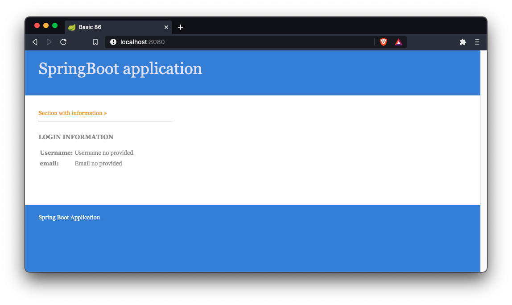
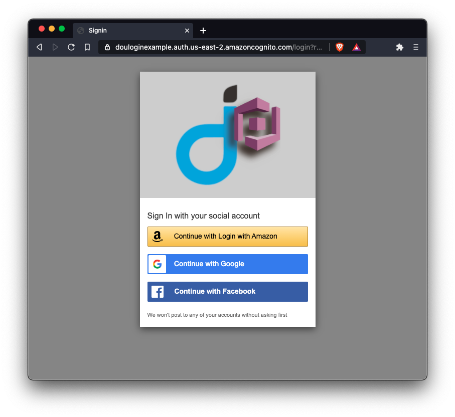
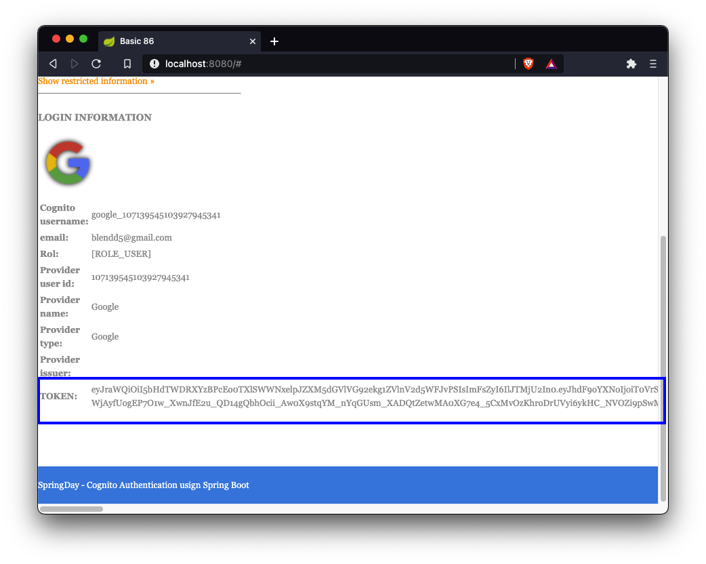
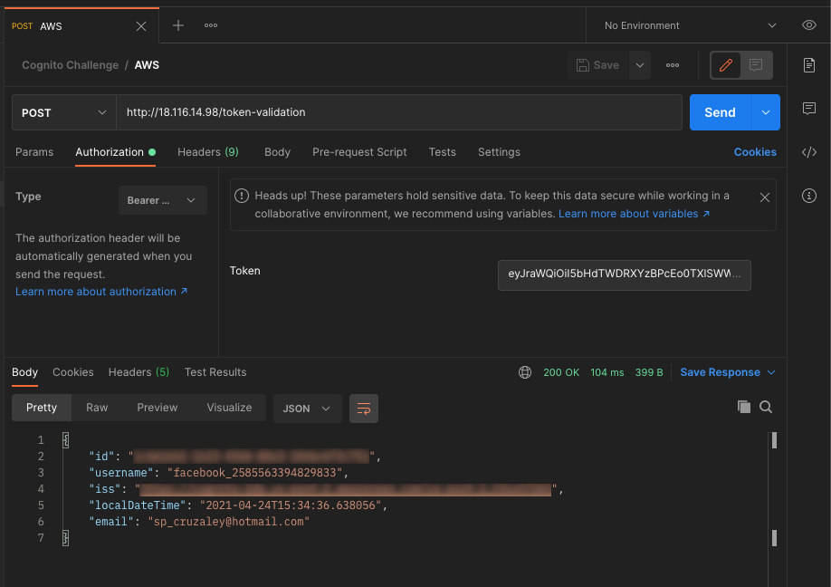

# Cognito Challenge

In this mini challenge you need to add the missing configuration to add a login link to Cognito.

This application doesn't have any configuration, if you run it you will to see something like this



So, here are the steps to follow

## Steps

### Step 1

You need to add the missing configuration to this project in order to add the login link to Cognito and generate a valid Token.

You need to use this information for Cognito configurations

| Property | value |
| :---: | :---: |
| App Client ID | 2s092rhdehnag7ocntdib7c2mh |
| App Secret ID | 1bslbp41j8cvkit7a9pl45tfjuk430oq8gavopa5f5bk6rt6a300 |
| App Name | appClient |
| Domain | douloginexample.auth.us-east-2.amazoncognito.com |
| JWK | https://cognito-idp.us-east-2.amazonaws.com/us-east-2_COsxhTGK5/.well-known/jwks.json |

### Step 2

Once you added all the missing configuration the login link should be show you this Cognito Login page



You can log in whit whatever account you want. 

### Step 3

After that you need to get the information sent by the Service Provider you chose and extract the Token ID, this is just an example:



NOTE: The Token can be extracted from Authorization object (_Not need to do any additional POST call_)

### Final Step

You need to send a POST call to this API `http://18.116.14.98/token-validation` sending in the `Authorization` header the Token gotten in the previous step. If you send a valid token, you will se a response like this:



That's it.

The winner will be the first person that makes the POST call to the endpoint, to validate that the information will be saved in a DB with the time. 

## Execution with maven

Using maven
```bash
$ mvn clean spring-boot:run
```

## Execution with java

Using maven
```bash
$ mvn clean package
$ java -jar target/<ARTIFACT_NAME>.jar
```

## Execution with Docker

Using maven
```bash
$ ./run.sh
```
