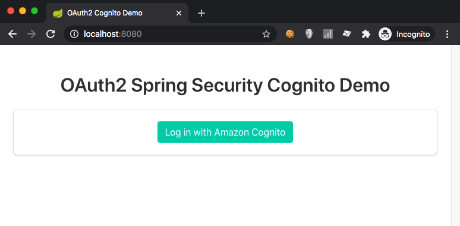
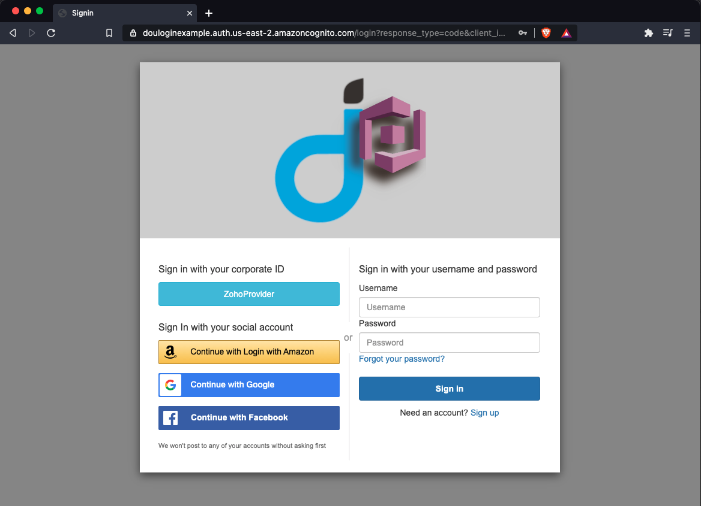
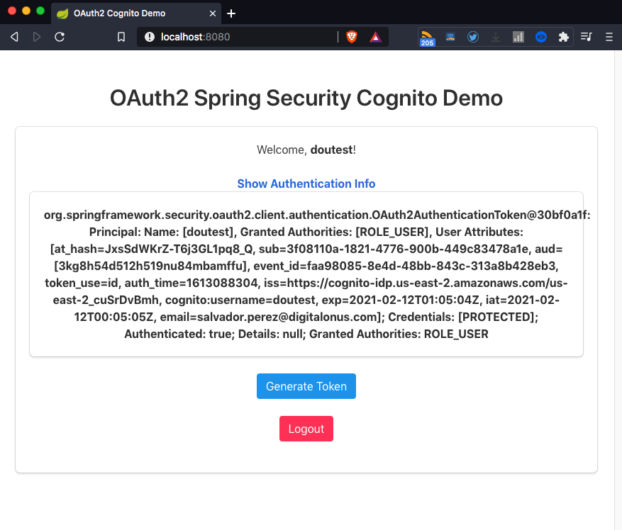

# Getting Started

### Execution

#### Requirements
* JDK 11
* Maven 3.*

Execution steps
```bash
$ mvn clean spring-boot:run
```

Open the browser and go to `http://localhost:8080` (*its configured in port 8080 by default*)

*Index page*


*Login form*


*Index page logged in*


*Authentication information*


### Reference Documentation
For further reference, please consider the following sections:

* [Official Apache Maven documentation](https://maven.apache.org/guides/index.html)
* [Spring Boot Maven Plugin Reference Guide](https://docs.spring.io/spring-boot/docs/2.4.2/maven-plugin/reference/html/)
* [Create an OCI image](https://docs.spring.io/spring-boot/docs/2.4.2/maven-plugin/reference/html/#build-image)
* [Spring Security](https://docs.spring.io/spring-boot/docs/2.4.2/reference/htmlsingle/#boot-features-security)
* [OAuth2 Client](https://docs.spring.io/spring-boot/docs/2.4.2/reference/htmlsingle/#boot-features-security-oauth2-client)
* [OAuth2 Resource Server](https://docs.spring.io/spring-boot/docs/2.4.2/reference/htmlsingle/#boot-features-security-oauth2-server)
* [Spring Web](https://docs.spring.io/spring-boot/docs/2.4.2/reference/htmlsingle/#boot-features-developing-web-applications)

### Guides
The following guides illustrate how to use some features concretely:

* [Securing a Web Application](https://spring.io/guides/gs/securing-web/)
* [Spring Boot and OAuth2](https://spring.io/guides/tutorials/spring-boot-oauth2/)
* [Authenticating a User with LDAP](https://spring.io/guides/gs/authenticating-ldap/)
* [Building a RESTful Web Service](https://spring.io/guides/gs/rest-service/)
* [Serving Web Content with Spring MVC](https://spring.io/guides/gs/serving-web-content/)
* [Building REST services with Spring](https://spring.io/guides/tutorials/bookmarks/)

___
*[Source information](https://www.harshajayamanna.com/)* 