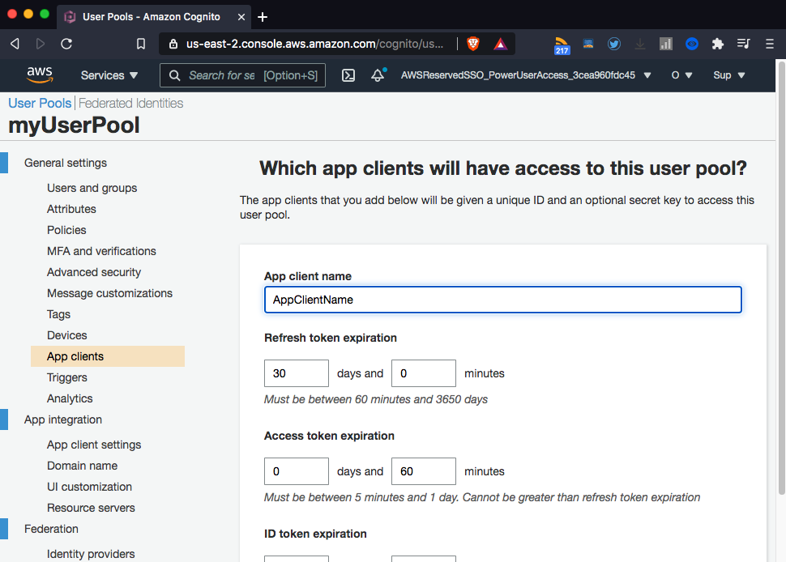
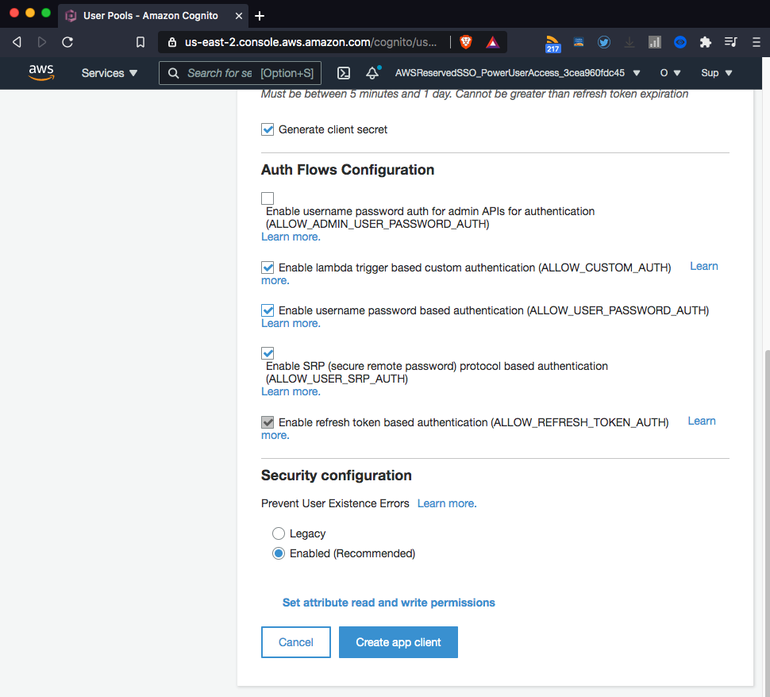
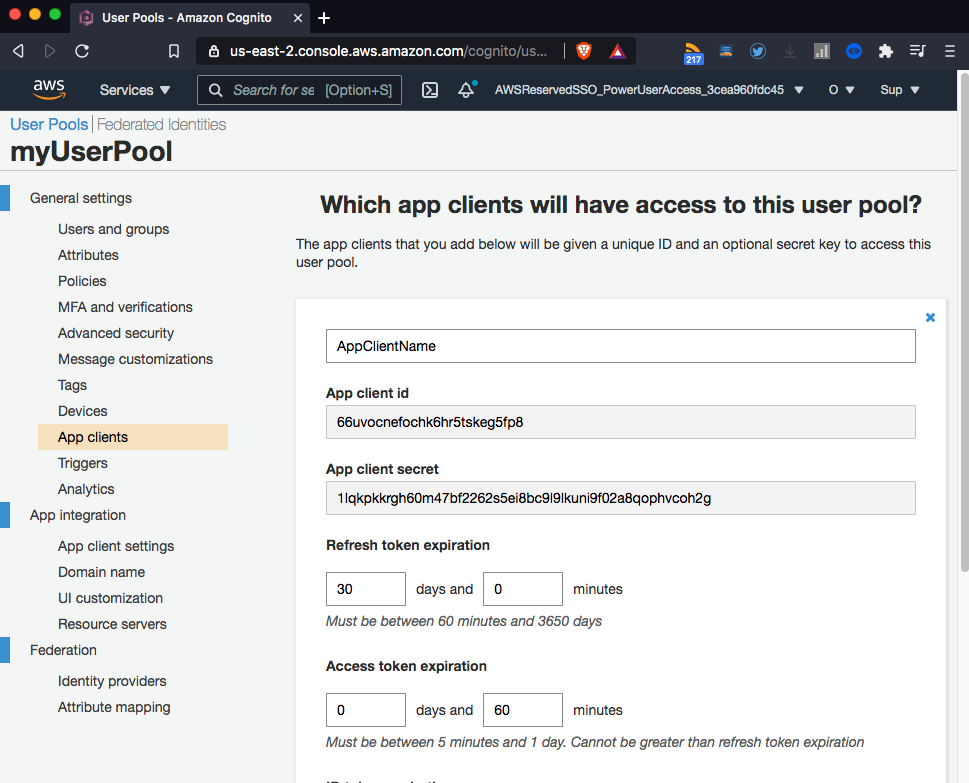

# Creating a User Pool in Cognito module (AWS)

*Before to start with this steps, **you need to have an AWS account**, you create it ***[here](https://aws.amazon.com/)***.*

Also you need to have created an [user pool](../user-pool/). 

### Creating an Application Client

